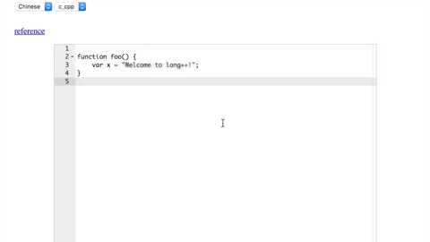

# lang++
A collection of code editing tools with support for non-English languages.

Many of the world's widely-used programming languages are English-based, making it difficult for many non-English speakers to learn to code. Programming is becoming increasingly valuable in today's world, putting non-English speakers at a disadvantage.

## Goals

 * Expand language-programming language translation database
   * As of now, lang++ supports only 1 lang-prog lang combination (Chinese-C++)
 * Improve method for parsing translation data / make data retrieval automated process
   * Currently, parsing involves using Python program to process .csv files (outputting data as single string)
   * String is then copy-pasted into html file as variable, parsed using D3
 * Incorporate machine learning
    * Improve translation accuracy
    * Consider context when suggesting autocompletions
    
See [issues](https://github.com/fibanneacci/langplusplus/issues) for detailed tasks and descriptions.

## Instructions

To see the online editor demo in action, follow these steps:
1. Download ACE Editor files from ACE Github (See "Dependencies / Built Using" below)
2. Download D3 files from D3 Github (See "Dependencies / Built Using" below)
3. Download lang++ repository and open index.html file using browser.
Alternately, you can visit [https://langpp.weebly.com](https://langpp.weebly.com).

You can find translations in the "translations" folder, in the form of .csv files (easy to view and edit) and .txt files (single string outputted by parsing program).
    
## Contributing

lang++ provides various opportunities for contributing, including:

 * Expanding the database of translations
 * Improving the demo code
 * Integrating machine learning

We greatly appreciate contributions; yours will not go unnoticed. Please visit [contributors](https://github.com/fibanneacci/langplusplus/contributors) to view a list of contributors this project. Read [CONTRIBUTING.md](https://github.com/fibanneacci/langplusplus/blob/master/.github/CONTRIBUTING.md) and [CODE_OF_CONDUCT.md](https://github.com/fibanneacci/langplusplus/blob/master/CODE_OF_CONDUCT.md) to learn more about contributing to lang++.

## Dependencies / Built Using
* ACE Editor - online editor demo - [ACE Editor Github Repo](https://github.com/ajaxorg/ace), [Official Website](https://ace.c9.io)
* D3 - parsing .csv data - [D3 Github Repo](https://github.com/d3/d3), [Official Website](https://d3js.org)

## Authors
* **Anne Li** - *Initial work* - [fibanneacci](https://github.com/fibanneacci)

View [contributors](https://github.com/fibanneacci/langplusplus/contributors) to this project.

## License
This project is licensed under the MIT License - see the [LICENSE](https://github.com/fibanneacci/langplusplus/blob/master/LICENSE) file for details
